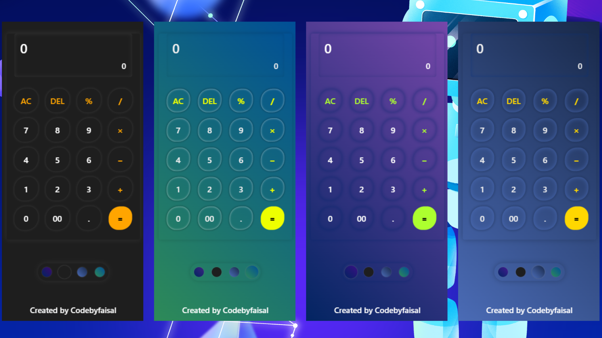

# Simple Web Calculator

A simple calculator web application with multiple themes for a pleasant user interface.

## Preview
Project Preview: [Here](https://codebyfaisal.github.io/simplewebcalculator/)



## Features

- Basic arithmetic operations: addition, subtraction, multiplication, division, modulus.
- Clear button (AC) to reset calculations.
- Delete button (DEL) to remove the last input.
- Dynamic theme switching for a personalized user experience.

## Technologies Used

- **HTML**: Structure of the calculator interface.
- **CSS**: Styling, including 4 different themes for UI customization.
- **JavaScript**: Functionality for calculator operations and theme switching.

## Themes
### Theme 1
- **Background**: Gradient (45deg) from #4b6cb7 to #182848
- **Button Shadow**: Outer: #1828486b, Inner: #4b6cb7b9
- **Container Shadow**: #1828486c
- **Screen Shadow**: Inset: #052f7c91
- **Active Button Shadow**: #182848b9
- **Function Color**: Gold
- **Text Color**: #eee

### Theme 2
- **Background**: Gradient (45deg) from #1e1e1e to #1e1e1e
- **Button Shadow**: Outer: #4646466b, Inner: #1e1e1eb9
- **Container Shadow**: #4747476c
- **Screen Shadow**: Inset: #3a3a3ab9
- **Active Button Shadow**: #1e1e1eb9
- **Function Color**: Orange
- **Text Color**: White

### Theme 3
- **Background**: Gradient (45deg) from #012461 to #45028bb9
- **Button Shadow**: Outer: #0123687c, Inner: #0123687c
- **Container Shadow**: #0123687c
- **Screen Shadow**: Inset: #01246148
- **Active Button Shadow**: #0123687c
- **Function Color**: Greenyellow
- **Text Color**: White

### Theme 4
- **Background**: Gradient (45deg) from #2e8b57 to #004e97
- **Button Shadow**: Outer: rgba(0, 0, 0, 0.2), Inner: rgba(255, 255, 255, 0.5)
- **Container Shadow**: rgba(0, 0, 0, 0.15)
- **Screen Shadow**: Inset: rgba(0, 0, 0, 0.1)
- **Active Button Shadow**: rgba(0, 0, 0, 0.3)
- **Function Color**: rgb(238, 255, 0)
- **Text Color**: #eee

## Installation

1. Clone the repository:
   ```
   git clone https://github.com/codebyfaisal/simplewebcalculator.git
   ```
2. Open `index.html` in your web browser.

OR 

Just simply download release calc-0.1 [Here](https://github.com/codebyfaisal/simplewebcalculator/releases/tag/javascript)
 -----
 -----

🚀 Happy Coding!
